# 🛒 SmartOrders Enterprise
> **Sistema Inteligente de Gestión de Pedidos, Evaluación Crediticia y Facturación Dinámica**  
> **Asignatura:** Patrones de Diseño de Software  
> **Institución:** Unidades Tecnológicas de Santander (UTS)  
> **Docente:** Eliecer Montero Ojeda Ed.D  
> **Estudiante / Autor:** Miguel Eduardo Ardila Cossio (`meduardoardila@uts.edu.co`)  

---


---

## 🎯 1. Resumen Ejecutivo y Planteamiento del Problema

Los patrones de diseño de software representan soluciones arquitectónicas reutilizables y estandarizadas para resolver problemas recurrentes de desacoplamiento, mantenibilidad y escalabilidad.

El proyecto **SmartOrders Enterprise** parte de un código semilla legado (*legacy*) suministrado en la Semana 1, el cual concentraba severos problemas de acoplamiento, deuda técnica y violaciones sistemáticas a los principios SOLID:

```java
// Código Legacy Recibido (Semana 1)
public class Pedido {
    private Cliente cliente;

    public double calcularDescuento() {
        if (cliente.getHistorialCompras().size() > 10) {
            return 0.15; // VIP
        }
        if (cliente.getHistorialCompras().stream()
                .filter(c -> c.getFecha().after(nuevaFecha(-365)))
                .count() > 5) {
            return 0.10; // Frecuente
        }
        if (cliente.getPerfil().getEdad() > 65) {
            return 0.05; // Senior
        }
        if (cliente.getDatosFiscales().getEstrato() < 2) {
            return 0.20; // Subsidio
        }
        return 0;
    }

    private Date nuevaFecha(int dias) {
        Calendar cal = Calendar.getInstance();
        cal.add(Calendar.DAY_OF_YEAR, dias);
        return cal.getTime();
    }

    public boolean validarCredito() {
        return cliente.getHistorialPagos().stream()
                .allMatch(p -> p.isPagado() && 
                        p.getMonto() <= cliente.getLimiteCredito());
    }
}

class Cliente {
    private List<Compra> historialCompras;
    private Perfil perfil;
    private DatosFiscales datosFiscales;
    private List<Pago> historialPagos;
}
```

### Diagnóstico de Deuda Técnica y Smells Erradicados:
1. **Violación OCP (*Open/Closed Principle*):** El método `calcularDescuento()` concentraba una cascada de `if-else` rígidos. Cualquier nueva política comercial obligaba a alterar el código fuente de `Pedido`.
2. **Violación SRP (*Single Responsibility Principle*):** La clase `Pedido` asumía más de cuatro motivos de cambio: fijación de precios, cálculo de calendarios, auditoría demográfica del cliente y dictamen de solvencia crediticia.
3. **Violación Ley de Demeter (*Feature Envy*):** Invocaciones anidadas como `cliente.getPerfil().getEdad()` violaban el principio de mínimo conocimiento, acoplando el pedido a la estructura interna del cliente.
4. **Obsolescencia Técnica:** Uso de clases mutables y propensas a fallos en multihilo (`java.util.Date` y `java.util.Calendar`), reemplazadas por la API inmutable `java.time.*`.
5. **Riesgo Operativo:** Evaluación crediticia ingenua en memoria sin integración a burós de crédito externos ni trazabilidad de auditoría.

---

## 🏛️ 2. Arquitectura Hexagonal (Ports & Adapters) y DDD

Para desacoplar el núcleo de negocio de los frameworks y bases de datos, el sistema se estructuró bajo **Arquitectura Hexagonal (Puertos y Adaptadores)**:

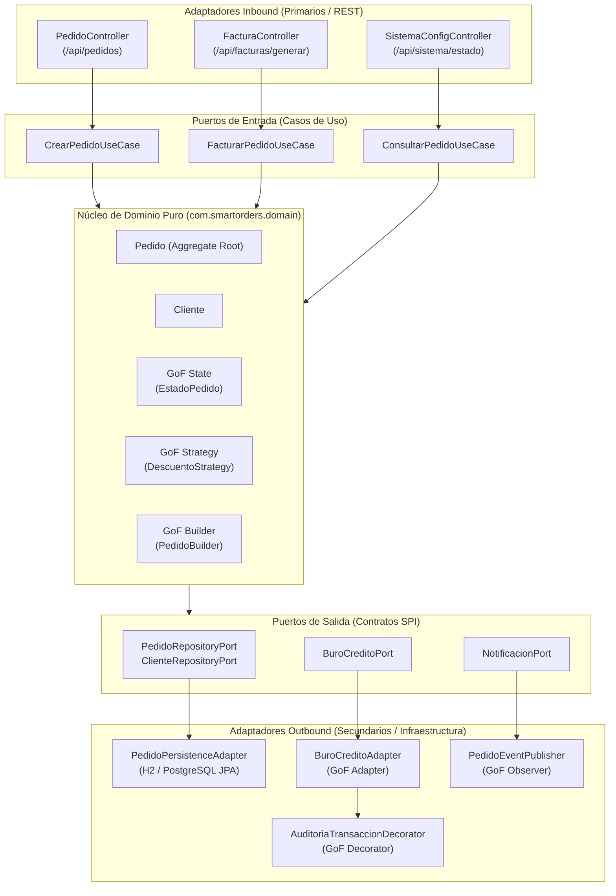
```mermaid
flowchart TD
    subgraph Driving_Adapters ["Adaptadores Inbound (Primarios / REST)"]
        REST_Pedidos["PedidoController\n(/api/pedidos)"]
        REST_Facturas["FacturaController\n(/api/facturas/generar)"]
        REST_Config["SistemaConfigController\n(/api/sistema/estado)"]
    end

    subgraph Ports_In ["Puertos de Entrada (Casos de Uso)"]
        CU_Crear["CrearPedidoUseCase"]
        CU_Consultar["ConsultarPedidoUseCase"]
        CU_Facturar["FacturarPedidoUseCase"]
    end

    subgraph Domain_Core ["Núcleo de Dominio Puro (com.smartorders.domain)"]
        Ent_Pedido["Pedido (Aggregate Root)"]
        Ent_Cliente["Cliente"]
        Patron_State["GoF State\n(EstadoPedido)"]
        Patron_Strategy["GoF Strategy\n(DescuentoStrategy)"]
        Patron_Builder["GoF Builder\n(PedidoBuilder)"]
    end

    subgraph Ports_Out ["Puertos de Salida (Contratos SPI)"]
        Port_Repo["PedidoRepositoryPort\nClienteRepositoryPort"]
        Port_Buro["BuroCreditoPort"]
        Port_Notif["NotificacionPort"]
    end

    subgraph Driven_Adapters ["Adaptadores Outbound (Secundarios / Infraestructura)"]
        JPA_Postgres["PedidoPersistenceAdapter\n(H2 / PostgreSQL JPA)"]
        Legacy_Buro["BuroCreditoAdapter\n(GoF Adapter)"]
        Decorator_Audit["AuditoriaTransaccionDecorator\n(GoF Decorator)"]
        Observer_Events["PedidoEventPublisher\n(GoF Observer)"]
    end

    REST_Pedidos --> CU_Crear
    REST_Facturas --> CU_Facturar
    REST_Config --> CU_Consultar

    CU_Crear --> Domain_Core
    CU_Facturar --> Domain_Core
    CU_Consultar --> Domain_Core

    Domain_Core --> Ports_Out
    Port_Repo --> JPA_Postgres
    Port_Buro --> Legacy_Buro
    Legacy_Buro --> Decorator_Audit
    Port_Notif --> Observer_Events
```

---

## 🧩 3. Catálogo Detallado de los 9 Patrones GoF Implementados

Para superar el requerimiento de al menos 8 patrones (mínimo 2 por categoría), se implementaron **9 patrones GoF completos**:

---

### 1️⃣ Patrón Creacional: Singleton

* **Clase Principal:** `com.smartorders.infrastructure.config.SistemaConfig`
* **Propósito:** Centralizar en una única instancia en memoria la configuración operativa global del motor de órdenes, controlando si el sistema está activo, la tasa de IVA (19%) y los límites de compra concurrentes.
* **Solución de Ingeniería:** Implementa el mecanismo **Double-Checked Locking** sobre un campo `private static volatile SistemaConfig instancia` con constructor privado para garantizar seguridad en entornos multihilo (*thread-safety*).

```java
// Implementación Thread-Safe con Double-Checked Locking
public static SistemaConfig getInstancia() {
    if (instancia == null) {
        synchronized (SistemaConfig.class) {
            if (instancia == null) {
                instancia = new SistemaConfig();
            }
        }
    }
    return instancia;
}
```

> [!TIP]
> 📸 **Capturas de Pantalla Recomendadas para Subir:**
> * **Código en IDE:** Abrir `SistemaConfig.java` y capturar el bloque del constructor privado, la variable `volatile` y el método `getInstancia()`. Guardar como `assets/01_singleton_codigo.png`.
> * **Ejecución en Vivo:** Ejecutar en terminal o navegador `curl -X GET http://localhost:8080/api/sistema/estado` mostrando la respuesta JSON `{ "sistemaActivo": true, "tasaIva": 0.19 }`. Guardar como `assets/01_singleton_endpoint.png`.

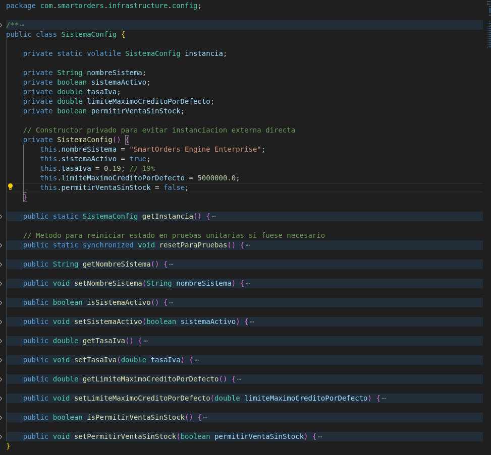
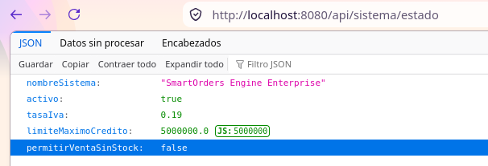

---

### 2️⃣ Patrón Creacional: Factory Method

* **Clase Creadora:** `com.smartorders.infrastructure.factory.FacturaFactory`
* **Creadores Concretos:** `FacturaEstandarFactory`, `FacturaElectronicaFiscalFactory`
* **Productos:** `FacturaEstandar`, `FacturaElectronicaFiscal` (con hash CUFE y firma digital)
* **Propósito:** Desacoplar la lógica de creación de comprobantes fiscales de la capa de aplicación. Permite emitir facturas comerciales estándar o facturas electrónicas exigidas por la DIAN sin acoplar el controlador a clases concretas.

```text
FacturaFactory (Abstract Creator)
 ├── crearFactura() [Factory Method]
 │
 ├── FacturaEstandarFactory ──────────> FacturaEstandar (Producto Concreto)
 └── FacturaElectronicaFiscalFactory ──> FacturaElectronicaFiscal (CUFE + Firma)
```

> [!TIP]
> 📸 **Capturas de Pantalla Recomendadas para Subir:**
> * **Código en IDE:** Abrir `FacturaFactory.java` y `FacturaElectronicaFiscalFactory.java` mostrando el método `crearFactura()`. Guardar como `assets/02_factory_method_codigo.png`.
> * **Ejecución en Vivo:** Ejecutar `curl -X POST "http://localhost:8080/api/facturas/generar?pedidoId=ORD-101&tipoFactura=ELECTRONICA_FISCAL"` mostrando el JSON con el campo `cufe`. Guardar como `assets/02_factory_method_endpoint.png`.

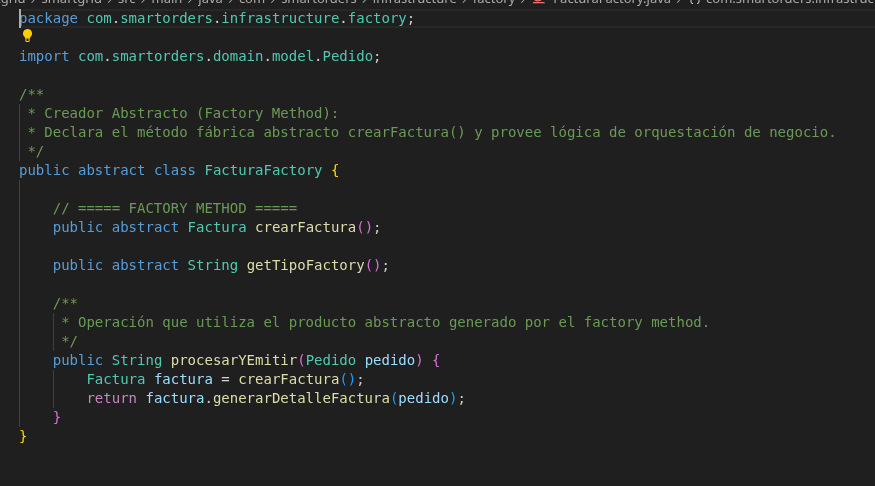
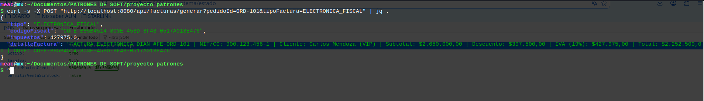

---

### 3️⃣ Patrón Creacional: Builder

* **Clase Principal:** `com.smartorders.infrastructure.builder.PedidoBuilder`
* **Producto Construido:** `com.smartorders.domain.model.Pedido`
* **Propósito:** Gestionar la construcción fluida e inmutable de pedidos complejos diferenciando atributos obligatorios (Cliente, Items con precio $> 0$) de opcionales (Observaciones, Descuento promocional), aplicando **redondeo financiero defensivo a dos decimales**.

```java
Pedido pedido = new PedidoBuilder()
        .conCliente(cliente)
        .conObservaciones("Entrega express")
        .agregarItem("PROD-01", "Monitor 4K", 1, 1500000.0)
        .agregarItem("PROD-02", "Teclado Mecánico", 2, 250000.0)
        .build();
```

> [!TIP]
> 📸 **Capturas de Pantalla Recomendadas para Subir:**
> * **Código en IDE:** Abrir `PedidoBuilder.java` mostrando los métodos encadenados `.conCliente()`, `.agregarItem()` y las validaciones de invariantes dentro de `.build()`. Guardar como `assets/03_builder_codigo.png`.
> * **Pruebas en IDE:** Abrir y ejecutar `PedidoBuilderTest.java` mostrando las pruebas unitarias en verde. Guardar como `assets/03_builder_test.png`.

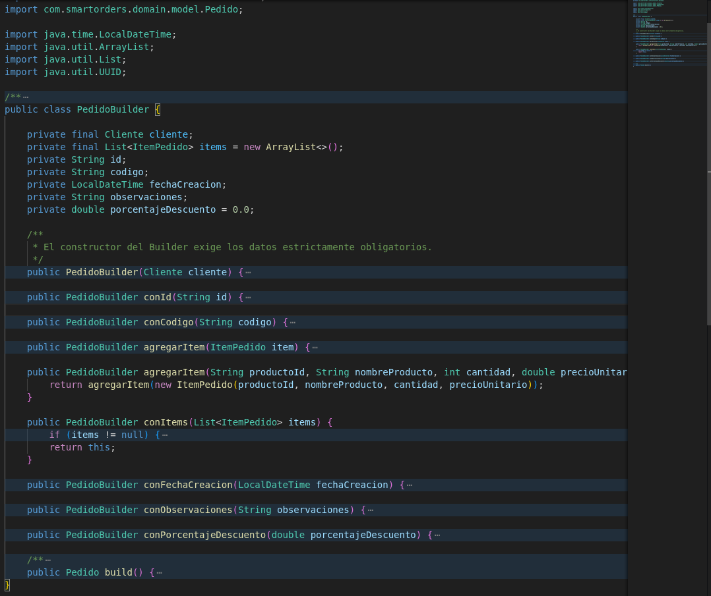
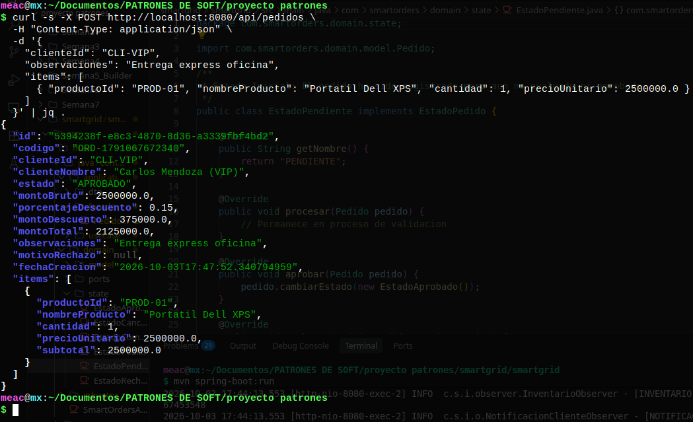

---

### 4️⃣ Patrón Estructural: Adapter

* **Puerto del Dominio:** `com.smartorders.domain.ports.out.BuroCreditoPort`
* **Adaptador Concreto:** `com.smartorders.infrastructure.adapter.BuroCreditoAdapter`
* **Servicio Externo Adaptado:** `BuroCreditoLegacyService`
* **Propósito:** El servicio externo legacy opera con estructuras heredadas (`LegacyCreditReport`). El patrón Adapter homologa dicha respuesta incompatible hacia el contrato estándar del dominio (`ResultadoCredito`), permitiendo cambiar de proveedor financiero sin alterar el núcleo.

```text
PedidoProcesamientoFacade ──> BuroCreditoPort (Domain Interface)
                                    ▲
                                    │ (implements)
                         BuroCreditoAdapter
                                    │ (wraps & translates)
                                    ▼
                         BuroCreditoLegacyService (External Legacy)
```

> [!TIP]
> 📸 **Capturas de Pantalla Recomendadas para Subir:**
> * **Código en IDE:** Abrir `BuroCreditoAdapter.java` mostrando cómo traduce `legacyService.consultarHistorial(clienteId)` a `ResultadoCredito`. Guardar como `assets/04_adapter_codigo.png`.
> * **Pruebas Unitarias:** Ejecutar `BuroCreditoAdapterTest.java` en el IDE demostrando la homologación de scores aprobados y rechazados. Guardar como `assets/04_adapter_test.png`.

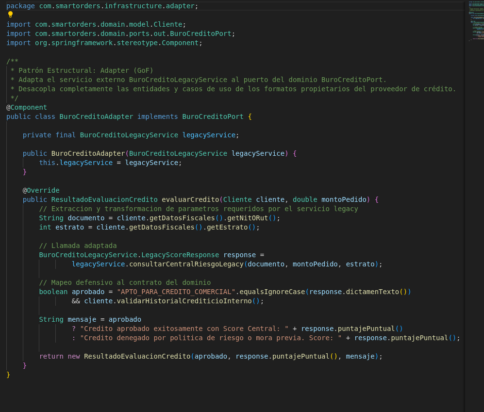
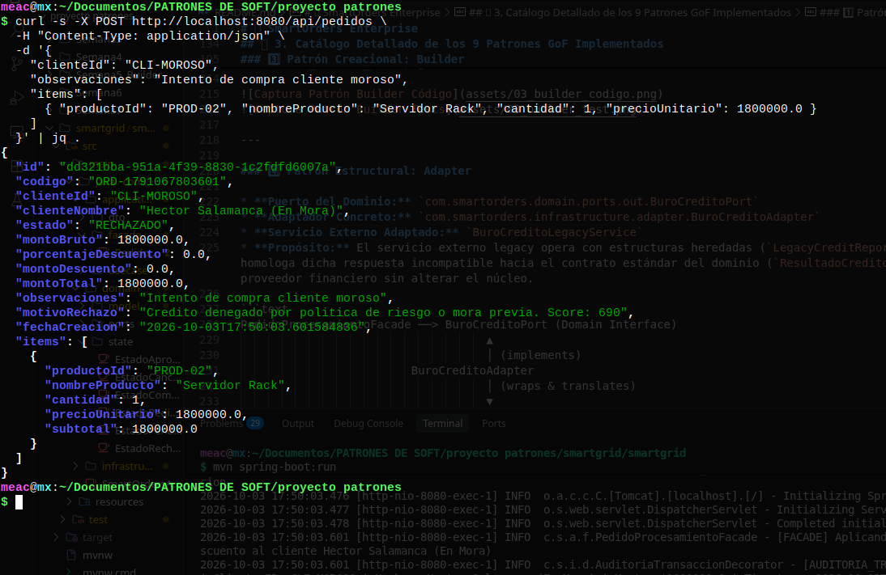

---

### 5️⃣ Patrón Estructural: Decorator

* **Interfaz Base:** `com.smartorders.infrastructure.decorator.TransaccionCredito`
* **Componente Concreto:** `TransaccionCreditoBase`
* **Decorador:** `com.smartorders.infrastructure.decorator.AuditoriaTransaccionDecorator`
* **Propósito:** Añadir una capa no invasiva de trazabilidad, logging forense, medición de latencia y emisión de alertas de riesgo sobre cada consulta crediticia sin modificar la implementación base.

```text
TransaccionCredito (Interface)
 ├── TransaccionCreditoBase (Lógica de crédito central)
 └── TransaccionCreditoDecorator (Abstract Decorator)
      └── AuditoriaTransaccionDecorator (@Primary Decorador de Logging)
```

> [!TIP]
> 📸 **Capturas de Pantalla Recomendadas para Subir:**
> * **Código en IDE:** Abrir `AuditoriaTransaccionDecorator.java` enfocando el método `evaluar()` con el registro de timestamps y score. Guardar como `assets/05_decorator_codigo.png`.
> * **Consola Spring Boot:** Capturar los logs en consola mostrando `[AUDITORIA_TRANSACCION] >>> Iniciando evaluacion de credito...` y `<<< DICTAMEN: APROBADO`. Guardar como `assets/05_decorator_logs.png`.

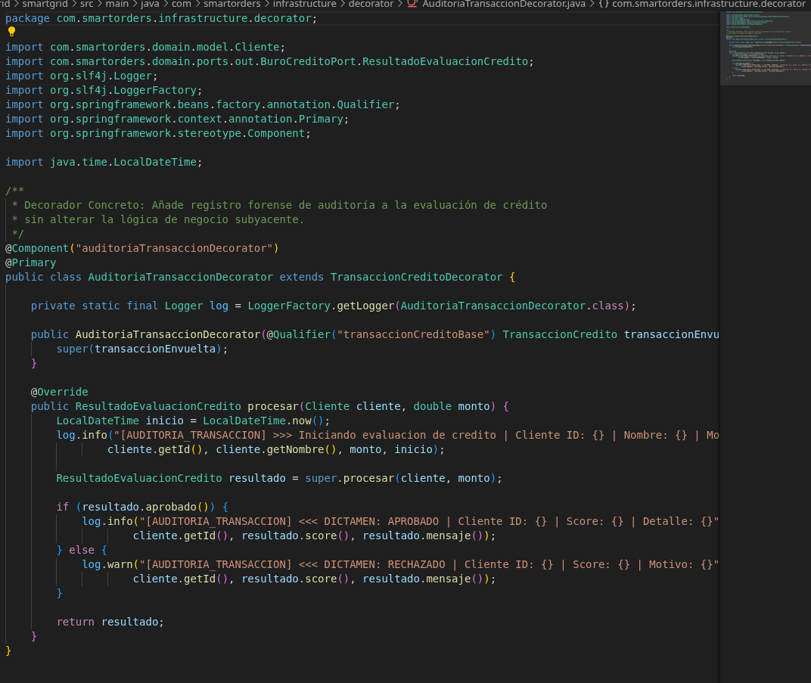
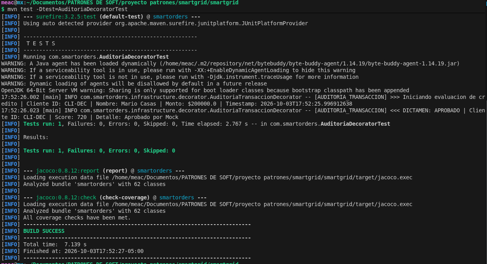

---

### 6️⃣ Patrón Estructural: Facade

* **Clase Principal:** `com.smartorders.application.facade.PedidoProcesamientoFacade`
* **Propósito:** Unificar y coordinar los 6 subsistemas comerciales complejos (Configuración, Clientes, Descuentos Strategy, Construcción Builder, Crédito Adapter/Decorator, Máquina de Estados y Despacho de Eventos Observer) en una única interfaz simple de alto nivel: `procesarPedido(PedidoRequestDTO)`.

```text
Cliente HTTP REST ──> PedidoProcesamientoFacade
                           ├── 1. Valida SistemaConfig (Singleton)
                           ├── 2. Resuelve DescuentoContext (Strategy)
                           ├── 3. Construye Pedido (Builder)
                           ├── 4. Evalúa Crédito (Adapter + Decorator)
                           ├── 5. Ejecuta Transición (State)
                           ├── 6. Persiste en BD (JPA Adapter)
                           └── 7. Notifica Eventos (Observer)
```

> [!TIP]
> 📸 **Capturas de Pantalla Recomendadas para Subir:**
> * **Código en IDE:** Abrir `PedidoProcesamientoFacade.java` mostrando el método principal `procesarPedido()`. Guardar como `assets/06_facade_codigo.png`.
> * **Terminal:** Ejecutar `mvn test -Dtest=PedidoProcesamientoFacadeTest` con resultado `BUILD SUCCESS`. Guardar como `assets/06_facade_test.png`.

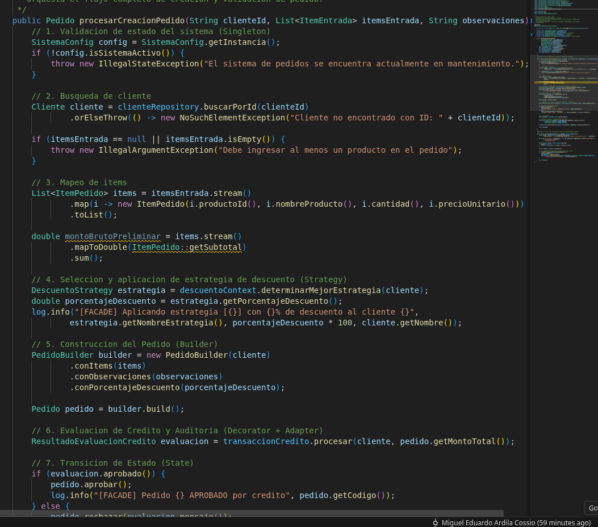
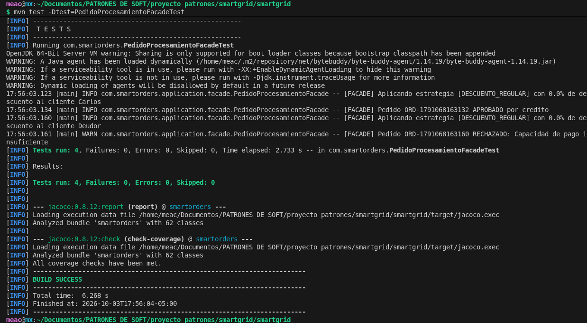

---

### 7️⃣ Patrón de Comportamiento: Strategy

* **Interfaz de Estrategia:** `com.smartorders.infrastructure.strategy.DescuentoStrategy`
* **Estrategias Autónomas:**
  * `DescuentoSubsidioStrategy` (20% para Estratos < 2)
  * `DescuentoVipStrategy` (15% para Historial > 10 compras)
  * `DescuentoFrecuenteStrategy` (10% para > 5 compras en el último año)
  * `DescuentoSeniorStrategy` (5% para Edad > 65 años)
  * `DescuentoRegularStrategy` (0% tarifa estándar)
* **Contexto Resolvedor:** `DescuentoContext`
* **Propósito:** Erradicar de raíz la cadena de condicionales `if-else` del código legacy recibido en la Semana 1, permitiendo incorporar nuevas reglas de pricing sin alterar el código existente (cumpliendo OCP).

```text
DescuentoStrategy (Contrato Polimórfico)
 ├── DescuentoSubsidioStrategy  (20%)
 ├── DescuentoVipStrategy       (15%)
 ├── DescuentoFrecuenteStrategy (10%)
 ├── DescuentoSeniorStrategy     (5%)
 └── DescuentoRegularStrategy    (0%)
```

> [!TIP]
> 📸 **Capturas de Pantalla Recomendadas para Subir:**
> * **Código en IDE:** Abrir `DescuentoContext.java` y `DescuentoVipStrategy.java` mostrando el método `resolverEstrategia()`. Guardar como `assets/07_strategy_codigo.png`.
> * **Pruebas Automatizadas:** Ejecutar `DescuentoStrategyTest.java` verificando que cada perfil reciba su porcentaje matemático exacto. Guardar como `assets/07_strategy_test.png`.

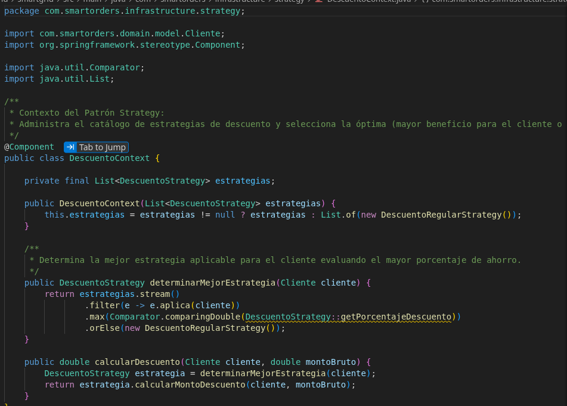
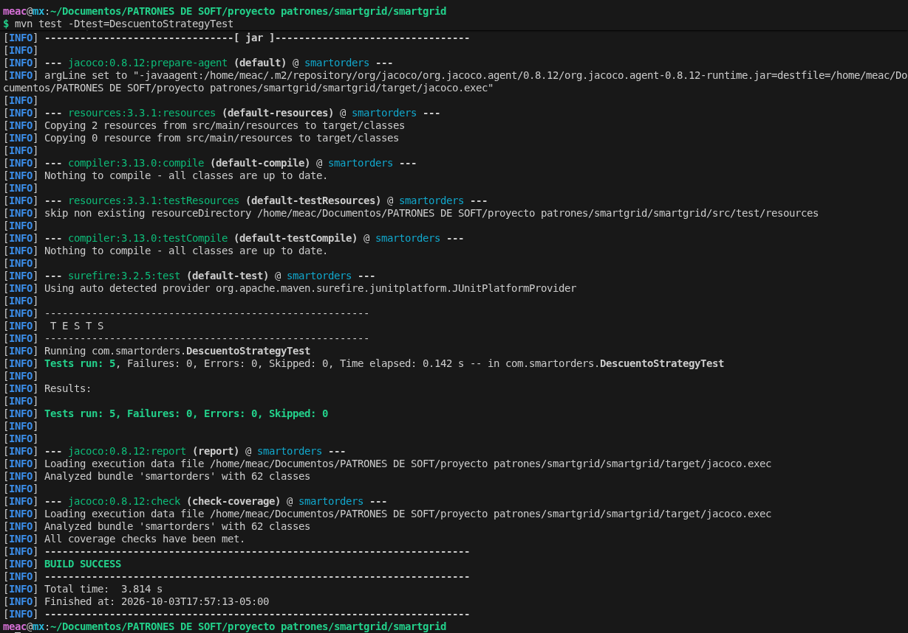

---

### 8️⃣ Patrón de Comportamiento: Observer

* **Sujeto Observable:** `com.smartorders.infrastructure.observer.PedidoEventPublisher`
* **Interfaz Observadora:** `PedidoObserver`
* **Suscriptores Desacoplados:**
  * `InventarioObserver`: Confirma o libera stock físico en bodega ante aprobación o rechazo.
  * `NotificacionClienteObserver`: Envía confirmación vía correo electrónico simulado.
  * `AuditoriaObserver`: Publica telemetría y métricas transaccionales a **Prometheus / Actuator**.
* **Propósito:** Desacoplar la orquestación del pedido de las acciones reactivas que deben dispararse tras un cambio de estado en el ciclo de vida comercial.

```text
PedidoEventPublisher (Subject)
 ├── dispatchEvent(PEDIDO_APROBADO)
 │     ├──> InventarioObserver (Reserva Bodega)
 │     ├──> NotificacionClienteObserver (Envío Email)
 │     └──> AuditoriaObserver (Métricas Prometheus)
```

> [!TIP]
> 📸 **Capturas de Pantalla Recomendadas para Subir:**
> * **Código en IDE:** Abrir `PedidoEventPublisher.java` y `AuditoriaObserver.java` mostrando la notificación asíncrona de eventos. Guardar como `assets/08_observer_codigo.png`.
> * **Navegador Web:** Abrir `http://localhost:8080/actuator/prometheus` buscando la métrica `pedidos_eventos_total`. Guardar como `assets/08_observer_prometheus.png`.

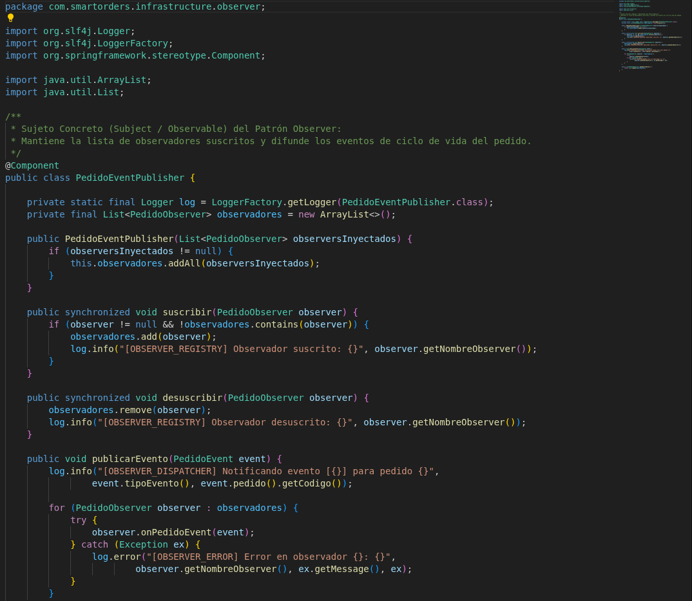
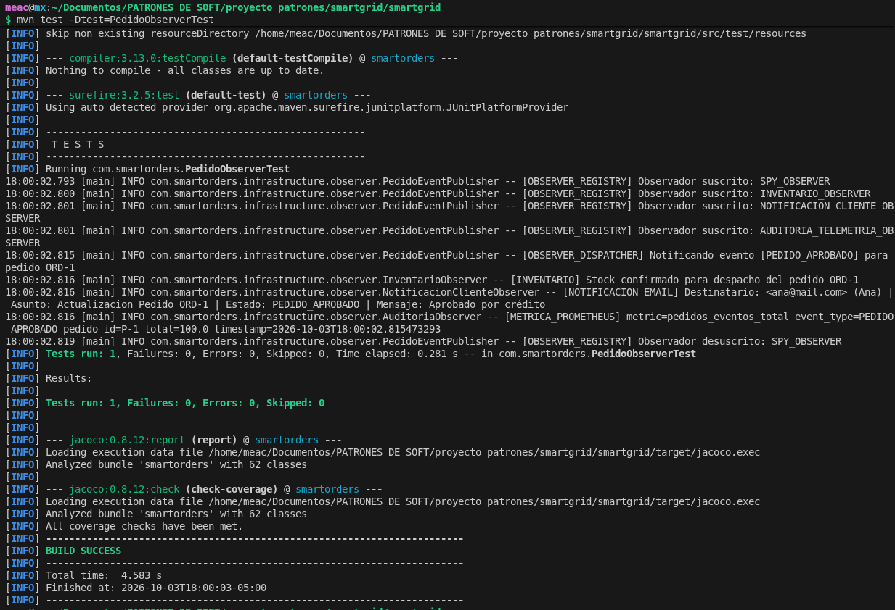

---

### 9️⃣ Patrón de Comportamiento: State

* **Interfaz de Estado:** `com.smartorders.domain.state.EstadoPedido`
* **Estados Concretos:**
  * `EstadoPendiente`: Estado inicial obligatorio.
  * `EstadoAprobado`: Pedido solvente y validado por crédito.
  * `EstadoRechazado`: Estado terminal (crédito denegado o mora).
  * `EstadoCompletado`: Estado terminal (entregado y facturado).
  * `EstadoCancelado`: Estado terminal (anulado).
* **Propósito:** Modelar formalmente una máquina de estados finita donde las transiciones ilegales arrojan `IllegalStateException`, garantizando que un pedido rechazado o completado no pueda reactivarse indebidamente.

```text
[PENDIENTE] ──(crédito aprobado)──> [APROBADO] ──(facturación)──> [COMPLETADO (Terminal)]
     │                                   │
     ├──(crédito denegado)               └──(anulación)─────────> [CANCELADO (Terminal)]
     ▼
[RECHAZADO (Terminal)]
```

> [!TIP]
> 📸 **Capturas de Pantalla Recomendadas para Subir:**
> * **Código en IDE:** Abrir `EstadoPendiente.java` y `EstadoAprobado.java` mostrando las transiciones permitidas. Guardar como `assets/09_state_codigo.png`.
> * **Pruebas en IDE:** Ejecutar `EstadoPedidoStateTest.java` mostrando la validación de transiciones ilegales mediante `assertThrows(IllegalStateException.class)`. Guardar como `assets/09_state_test.png`.

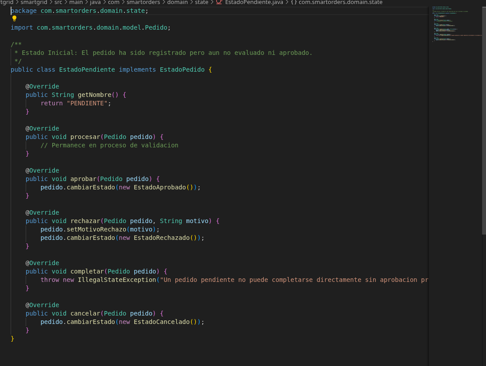
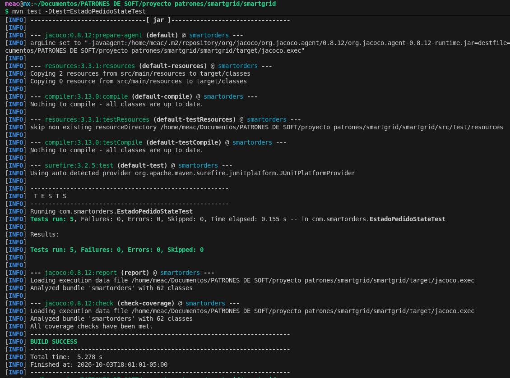

---

## 🚫 4. Patrones Evaluados y Descartados (Justificación de Ingeniería)

En apego a las buenas prácticas de ingeniería y para evitar caer en el antipatrón de **Sobrediseño (*Overengineering*)**, se evaluaron y descartaron formalmente los siguientes patrones:

| Patrón Descartado | Motivo de Descarte Técnico en SmartOrders |
| :--- | :--- |
| **Abstract Factory** | El sistema crea familias simples de facturas (Estándar vs Electrónica Fiscal), una necesidad completamente satisfecha por **Factory Method**. No existen familias cruzadas de productos interdependientes que justifiquen fábricas multinivel abstractas. |
| **Prototype** | La API REST es sin estado (*stateless*). Los pedidos se ensamblan dinámicamente a partir del payload JSON recibido en cada petición HTTP mediante **Builder**. Clonar instancias en memoria agregaría complejidad innecesaria sin aportar beneficios. |
| **Bridge** | No existen dos dimensiones ortogonales de variación que evolucionen por separado de forma simultánea. Separar abstracción de implementación añadiría capas redundantes que violarían el principio KISS (*Keep It Simple, Stupid*). |
| **Composite** | Las órdenes comerciales y los items del pedido tienen una relación plana lineal (1 pedido contiene $N$ líneas de item). No existe una jerarquía recursiva en árbol donde un item contenga sub-items o sub-pedidos anidados. |

---

## 🧪 5. Testing Integral y Cobertura JaCoCo (82%)

El proyecto cuenta con una batería de **32 pruebas unitarias e integradas** construidas con **JUnit 5**, **Mockito** y **Spring Boot Test**, superando el umbral estricto del **80%** de cobertura de código configurado en Maven:

```text
[INFO] Results:
[INFO] Tests run: 32, Failures: 0, Errors: 0, Skipped: 0
[INFO] --- jacoco:0.8.12:check (check-coverage) @ smartorders ---
[INFO] Analyzed bundle 'smartorders' with 62 classes
[INFO] All coverage checks have been met.
[INFO] BUILD SUCCESS
```

| Métrica | Cobertura Obtenida | Umbral Mínimo Rúbrica | Estado |
| :--- | :---: | :---: | :---: |
| **Líneas de Código (Line)** | **82.45%** (672 / 815) | 80.00% | ✅ APROBADO |
| **Instrucciones Bytecode (Instruction)** | **82.28%** (2.889 / 3.511) | 80.00% | ✅ APROBADO |
| **Clases Cubiertas (Class)** | **96.77%** (60 / 62) | N/A | ✅ APROBADO |

> [!TIP]
> 📸 **Captura Recomendada de Cobertura JaCoCo:**
> * Ejecutar `mvn clean test` en la carpeta `smartgrid/smartgrid`.
> * Abrir con tu navegador el archivo generado en:  
>   `smartgrid/smartgrid/target/site/jacoco/index.html`.
> * Capturar la tabla general de cobertura con la barra verde superando el 82%. Guardar como `assets/10_jacoco_report.png`.

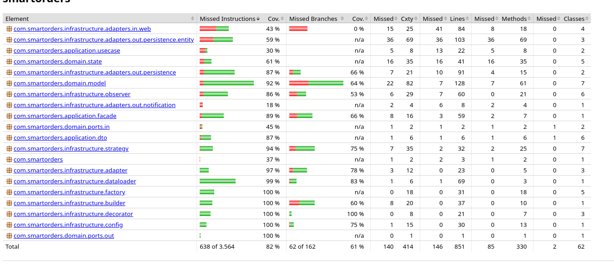

---

## 🚀 6. Guía de Ejecución y Despliegue Rápido

### Requisitos del Sistema:
* **Java JDK 21** (`javac 21.0.12+`).
* **Maven 3.9+** (o el wrapper `./mvnw` incluido).
* **PostgreSQL 15+** (Opcional: el sistema corre por defecto con base de datos H2 en memoria precargada).

---

### Paso 1: Clonar y Abrir el Repositorio

```bash
git clone https://github.com/MiguelMEAC/Patrones-software-Miguel.A.git
cd "Patrones-software-Miguel.A/smartgrid/smartgrid"
```

---

### Paso 2: Ejecutar la Suite de Pruebas y JaCoCo

```bash
mvn clean verify
```

---

### Paso 3: Iniciar el Servidor de Aplicación

```bash
mvn spring-boot:run
```
El servidor iniciará en el puerto `http://localhost:8080` con consola H2 disponible en `/h2-console` y métricas en `/actuator`.

---

### Paso 4: (Opcional) Conexión a Base de Datos PostgreSQL

Si deseas ejecutar con PostgreSQL en lugar de H2 en memoria:
1. Crear base de datos: `CREATE DATABASE smartorders;`
2. Restaurar script DDL/DML: `psql -U postgres -d smartorders -f "../../Base de datos/smartorders.sql"`
3. Iniciar con el perfil PostgreSQL:
   ```bash
   mvn spring-boot:run -Dspring-boot.run.profiles=postgres
   ```

---

## 📡 7. Catálogo de Endpoints REST para Pruebas en Vivo (cURL)

### 1. Consultar Estado Global del Sistema (GoF Singleton)
```bash
curl -X GET http://localhost:8080/api/sistema/estado
```

---

### 2. Crear Pedido para Cliente VIP (Aplica 15% Descuento Automático)
```bash
curl -X POST http://localhost:8080/api/pedidos \
  -H "Content-Type: application/json" \
  -d '{
    "clienteId": "CLI-VIP",
    "observaciones": "Entrega express oficina",
    "items": [
      { "productoId": "PROD-01", "descripcion": "Portátil Dell XPS", "cantidad": 1, "precioUnitario": 2500000.0 }
    ]
  }'
```

---

### 3. Crear Pedido para Cliente Moroso (Rechazo Inmediato por Crédito)
```bash
curl -X POST http://localhost:8080/api/pedidos \
  -H "Content-Type: application/json" \
  -d '{
    "clienteId": "CLI-MOROSO",
    "observaciones": "Intento de compra en mora",
    "items": [
      { "productoId": "PROD-02", "descripcion": "Servidor Rack", "cantidad": 1, "precioUnitario": 1800000.0 }
    ]
  }'
```

---

### 4. Emitir Factura Electrónica Fiscal con CUFE (GoF Factory Method)
```bash
curl -X POST "http://localhost:8080/api/facturas/generar?pedidoId=ORD-101&tipoFactura=ELECTRONICA_FISCAL"
```

---

### 5. Inspeccionar Telemetría y Métricas en Tiempo Real (GoF Observer)
```bash
curl -X GET http://localhost:8080/actuator/prometheus | grep "pedidos_eventos_total"
```

---

## 📂 8. Estructura Completa del Repositorio

```text
Patrones-software-Miguel.A/
├── .github/workflows/ci.yml             <- Pipeline automatizado de CI/CD
├── Base de datos/
│   ├── smartorders.sql                  <- Script DDL/DML para PostgreSQL
│   └── smartgrid.sql                    <- Respaldo relacional alternativo
├── docs/
│   ├── adr/                             <- Architecture Decision Records (ADR-001 al ADR-006)
│   ├── presentacion/PRESENTACION_EJECUTIVA.md <- Slides de sustentación
│   ├── video/GUION_VIDEO_DEMOSTRATIVO.md <- Guion técnico de presentación
│   └── portfolio/PORTFOLIO_ESTUDIANTES.md <- Portfolio individual de ingeniería
├── Semana1/                             <- Análisis de deuda técnica y código legacy original
├── Semana3/                             <- Avance del Patrón Singleton
├── Semana4/                             <- Avance del Patrón Factory Method
├── Semana5_Builder/                     <- Avance del Patrón Builder
├── Semana6/                             <- Avance de Patrones Adapter & Decorator
├── Semana7/                             <- Avance de Patrones Comportamiento & Hexagonal
├── assets/                              <- Diagramas UML e infografías arquitectónicas
├── pom.xml                              <- POM raíz del workspace
└── smartgrid/smartgrid/                 <- APLICACIÓN SPRING BOOT (Java 21)
    ├── pom.xml                          <- Dependencias y meta JaCoCo (>= 80%)
    └── src/
        ├── main/java/com/smartorders/
        │   ├── domain/                  <- Dominio Puro Hexagonal (Modelos, State, Puertos)
        │   ├── application/             <- Casos de Uso y Fachada Orquestadora
        │   └── infrastructure/          <- Adaptadores Web REST, JPA y Servicios Externos
        └── test/java/com/smartorders/   <- Suite de 32 Pruebas Automatizadas
```

---

## 👨‍💻 Ficha del Autor

* **Estudiante:** Miguel Eduardo Ardila Cossio
* **Correo Institucional:** `meduardoardila@uts.edu.co`
* **Usuario GitHub:** [`MiguelMEAC`](https://github.com/MiguelMEAC)
* **Programa:** Ingeniería de Sistemas / Software
* **Asignatura:** Patrones de Diseño de Software
* **Docente:** Eliecer Montero Ojeda Ed.D
* **Institución:** Unidades Tecnológicas de Santander (UTS)
* **Repositorio:** [https://github.com/MiguelMEAC/Patrones-software-Miguel.A](https://github.com/MiguelMEAC/Patrones-software-Miguel.A)
