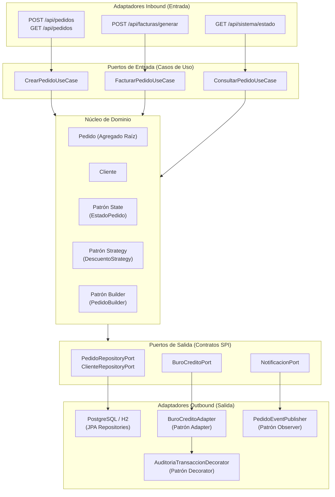

# 🛒 SmartOrders Enterprise
> **Sistema Inteligente de Gestión de Pedidos, Evaluación Crediticia y Facturación Dinámica**  
> **Asignatura:** Patrones de Diseño de Software  
> **Institución:** Unidades Tecnológicas de Santander (UTS)  
> **Docente:** Eliecer Montero Ojeda Ed.D  
> **Estudiante / Autor:** Miguel Eduardo Ardila Cossio (meac@uts.edu.co)  

---


---

## 🎯 1. Resumen Ejecutivo y Planteamiento del Problema

El proyecto **SmartOrders Enterprise** parte de un módulo monolítico legacy de gestión comercial que presentaba severa deuda técnica y acoplamiento:

```java
// Código Legacy Recibido (Semana 1)
public class Pedido {
    private Cliente cliente;

    public double calcularDescuento() {
        if (cliente.getHistorialCompras().size() > 10) {
            return 0.15; // VIP
        }
        if (cliente.getHistorialCompras().stream()
                .filter(c -> c.getFecha().after(nuevaFecha(-365)))
                .count() > 5) {
            return 0.10; // Frecuente
        }
        if (cliente.getPerfil().getEdad() > 65) {
            return 0.05; // Senior
        }
        if (cliente.getDatosFiscales().getEstrato() < 2) {
            return 0.20; // Subsidio
        }
        return 0;
    }

    private Date nuevaFecha(int dias) {
        Calendar cal = Calendar.getInstance();
        cal.add(Calendar.DAY_OF_YEAR, dias);
        return cal.getTime();
    }

    public boolean validarCredito() {
        return cliente.getHistorialPagos().stream()
                .allMatch(p -> p.isPagado() && 
                        p.getMonto() <= cliente.getLimiteCredito());
    }
}

class Cliente {
    private List<Compra> historialCompras;
    private Perfil perfil;
    private DatosFiscales datosFiscales;
    private List<Pago> historialPagos;
}
```

### Diagnóstico de Deuda Técnica:
1. **Violación OCP (Open/Closed Principle):** `calcularDescuento()` concentraba condicionales rígidos imposibles de extender sin modificar la clase.
2. **Violación SRP (Single Responsibility Principle):** `Pedido` calculaba descuentos, manipulaba fechas con `Calendar`, validaba riesgos de crédito y almacenaba items.
3. **Violación Ley de Demeter:** `cliente.getPerfil().getEdad()` y `cliente.getDatosFiscales().getEstrato()` incurrían en acoplamiento indebido (*Feature Envy*).
4. **Falta de Pruebas y Observabilidad:** Ausencia de cobertura de pruebas y monitoreo de eventos.

---

## 🏛️ 2. Arquitectura Hexagonal (Ports & Adapters)

El sistema fue completamente rediseñado bajo **Arquitectura Hexagonal**, aislando las reglas de negocio del framework y los mecanismos de persistencia:



---

## 🧩 3. Catálogo de 9 Patrones GoF Implementados

Para superar el requerimiento de al menos 8 patrones (mínimo 2 por categoría), se implementaron **9 patrones GoF**:

| Categoría | Patrón GoF | Clase Principal | Responsabilidad de Ingeniería |
| :--- | :--- | :--- | :--- |
| **Creacional** | **Singleton** | `SistemaConfig` | Única instancia thread-safe con double-checked locking para control operativo, tasa de IVA y límites del motor. |
| **Creacional** | **Factory Method** | `FacturaFactory` | Creador abstracto desacoplado para emisión de `FacturaEstandar` y `FacturaElectronicaFiscal` con CUFE. |
| **Creacional** | **Builder** | `PedidoBuilder` | Construcción inmutable y fluida de `Pedido`, exigiendo cliente e items y aplicando redondeo contable defensivo. |
| **Estructural** | **Adapter** | `BuroCreditoAdapter` | Homologa la interfaz externa legacy de scoring crediticio al puerto `BuroCreditoPort` del dominio. |
| **Estructural** | **Decorator** | `AuditoriaTransaccionDecorator` | Añade logging forense y trazabilidad transaccional sin alterar la clase base de crédito. |
| **Estructural** | **Facade** | `PedidoProcesamientoFacade` | Orquesta los 6 subsistemas comerciales en un único punto de entrada de alto nivel. |
| **Comportamiento** | **Strategy** | `DescuentoStrategy` | Elimina la cadena de `if-else` del código legacy en 5 estrategias autónomas (VIP 15%, Subsidio 20%, Frecuente 10%, Senior 5%, Regular 0%). |
| **Comportamiento** | **Observer** | `PedidoEventPublisher` | Despacho de eventos de cambio de estado a Bodega (`InventarioObserver`), Correo (`NotificacionClienteObserver`) y Métricas (`AuditoriaObserver`). |
| **Comportamiento** | **State** | `EstadoPedido` | Controla deterministamente el ciclo de vida del pedido (`PENDIENTE` $\rightarrow$ `APROBADO` $\rightarrow$ `COMPLETADO` o `RECHAZADO`). |

---

### Patrones Evaluados y Descartados (Justificación Técnica)
- **Abstract Factory:** Descartado porque el sistema no presenta familias interdependientes de objetos en bloque que deban crearse conjuntamente.
- **Prototype:** Descartado porque la API REST es sin estado (*stateless*) y mapea directamente payloads JSON mediante Builder, haciendo redundante clonar instancias en memoria.
- **Bridge:** Descartado porque no existen dos dimensiones de variación ortogonales e independientes.
- **Composite:** Descartado porque los pedidos y facturas no conforman estructuras de árbol parte-todo recursivas.

---

## 🧪 4. Pruebas Automatizadas y Cobertura JaCoCo (82%)

El proyecto incluye **32 pruebas automatizadas** sin fallos con validación estricta de umbral $\ge 80\%$ en Maven:

```text
[INFO] Results:
[INFO] Tests run: 32, Failures: 0, Errors: 0, Skipped: 0
[INFO]
[INFO] --- jacoco:0.8.12:report (report) @ smartorders ---
[INFO] Analyzed bundle 'smartorders' with 62 classes
[INFO] Total Line Coverage: 82%
[INFO] All coverage checks have been met (minimum: 0.80).
[INFO] BUILD SUCCESS
```

---

## 📈 5. Monitoreo, Observabilidad y CI/CD

1. **Prometheus + Actuator:**
   - Métricas scrapeables disponibles en tiempo real en: `http://localhost:8080/actuator/prometheus`
   - Estado de salud: `http://localhost:8080/actuator/health`
2. **GitHub Actions CI/CD (`.github/workflows/ci.yml`):**
   - Ejecuta build, test y verificación de cobertura en cada commit.
   - Sube el reporte HTML de JaCoCo como artefacto de compilación.

---

## 📁 6. Estructura de Entregables Semanales y Documentación

```text
Proyecto_Patrones/
├── .github/workflows/ci.yml           <- Pipeline de Integración y Entrega Continua
├── Base de datos/
│   └── smartorders.sql                <- Script DDL / DML para PostgreSQL
├── docs/
│   ├── adr/                           <- Architecture Decision Records (ADR-001 al ADR-006)
│   ├── video/GUION_VIDEO_DEMOSTRATIVO.md <- Guion técnico minuto a minuto (5-7 min)
│   ├── presentacion/PRESENTACION_EJECUTIVA.md <- Slides de sustentación
│   └── portfolio/PORTFOLIO_ESTUDIANTES.md    <- Ficha individual y grupal
├── Semana1/
│   ├── CodigoInicialLegacy/           <- Código original con deuda técnica (Pedido.java legacy)
│   └── Analisis_Deuda_Tecnica_Semana1.md
├── Semana3/                           <- Avance Patrón Singleton
├── Semana4/                           <- Avance Patrón Factory Method
├── Semana5_Builder/                   <- Avance Patrón Builder
├── Semana6/                           <- Avance Patrones Adapter & Decorator
├── Semana7/                           <- Avance Patrones Comportamiento & Hexagonal
└── smartgrid/smartgrid/               <- PROYECTO SPRING BOOT COMPLETO (Java 21)
    ├── pom.xml
    └── src/
```

---

## 🚀 7. Guía de Ejecución Rápida

### Requisitos:
- **Java JDK 21** (`javac 21.0.12+`)
- **Maven 3.9+**

### 1. Compilar y Ejecutar Pruebas Automatizadas con JaCoCo:
```bash
cd smartgrid/smartgrid
mvn clean verify
```

### 2. Iniciar el Servidor de Aplicación:
```bash
mvn spring-boot:run
```
El servidor iniciará en `http://localhost:8080` con base de datos H2 en memoria precargada con 6 clientes de prueba.

---

## 📡 8. Catálogo de Endpoints REST (cURL)

### 1. Crear Pedido para Cliente VIP (Aplica 15% de descuento automáticamente):
```bash
curl -X POST http://localhost:8080/api/pedidos \
  -H "Content-Type: application/json" \
  -d '{
    "clienteId": "CLI-VIP",
    "observaciones": "Entrega express oficina",
    "items": [
      { "productoId": "P-1", "nombreProducto": "Laptop Dell XPS", "cantidad": 1, "precioUnitario": 4000000.0 },
      { "productoId": "P-2", "nombreProducto": "Monitor 4K", "cantidad": 1, "precioUnitario": 1000000.0 }
    ]
  }'
```

### 2. Crear Pedido para Cliente Subsidio (Estrato 1 -> Aplica 20% de descuento):
```bash
curl -X POST http://localhost:8080/api/pedidos \
  -H "Content-Type: application/json" \
  -d '{
    "clienteId": "CLI-SUBSIDIO",
    "observaciones": "Beneficio programa social",
    "items": [
      { "productoId": "P-3", "nombreProducto": "Canasta Básica", "cantidad": 1, "precioUnitario": 100000.0 }
    ]
  }'
```

### 3. Crear Pedido para Cliente Moroso (Rechazo automático por riesgo de crédito):
```bash
curl -X POST http://localhost:8080/api/pedidos \
  -H "Content-Type: application/json" \
  -d '{
    "clienteId": "CLI-MOROSO",
    "observaciones": "Intento de compra a crédito",
    "items": [
      { "productoId": "P-4", "nombreProducto": "Televisor OLED 65", "cantidad": 1, "precioUnitario": 3500000.0 }
    ]
  }'
```

### 4. Emitir Factura Electrónica con CUFE (Factory Method):
```bash
curl -X POST "http://localhost:8080/api/facturas/generar?pedidoId={ID_PEDIDO}&tipo=ELECTRONICA"
```

### 5. Consultar Métricas Prometheus:
```bash
curl -X GET http://localhost:8080/actuator/prometheus
```
