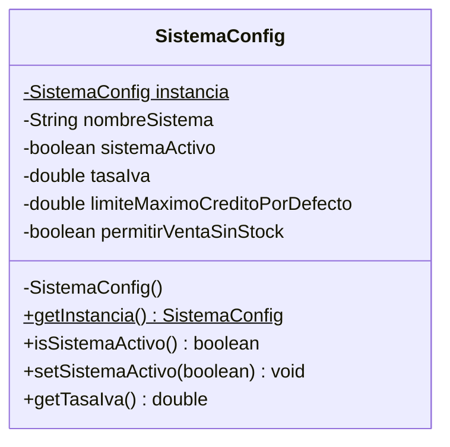

# 📑 INFORME TÉCNICO - SEMANA 3: PATRÓN CREACIONAL SINGLETON
## Proyecto: SmartOrders Enterprise
### Patrón Implementado: Singleton (GoF) en `SistemaConfig`

---

### 1. Justificación y Propósito
En un sistema empresarial de pedidos y facturación, es crítico contar con un punto de verdad unificado para controlar:
- Si el motor de pedidos está **ACTIVO** o en **MANTENIMIENTO**.
- La tasa impositiva global (IVA 19%).
- Los límites crediticios por defecto y políticas de stock.

Si múltiples instancias de configuración coexistieran, podrían ocurrir discrepancias graves (ej. una orden procesada bajo una tasa de IVA obsoleta mientras otra usa la vigente).

---

### 2. Implementación de Ingeniería
Se diseñó la clase `SistemaConfig` aplicando:
1. **Constructor Privado:** Impide la creación de instancias mediante `new SistemaConfig()`.
2. **Variable Estática Volátil:** `private static volatile SistemaConfig instancia;` garantiza visibilidad inmediata entre hilos.
3. **Double-Checked Locking:**
   ```java
   public static SistemaConfig getInstancia() {
       if (instancia == null) {
           synchronized (SistemaConfig.class) {
               if (instancia == null) {
                   instancia = new SistemaConfig();
               }
           }
       }
       return instancia;
   }
   ```

---

### 3. Diagrama UML del Patrón


---

### 4. Verificación y Pruebas Unitarias
El archivo de pruebas `SistemaConfigTest.java` somete la clase a:
- Validación de identidad referencial (`assertSame`).
- Prueba de estrés concurrente con `ExecutorService` de 50 hilos simultáneos usando `CountDownLatch`.
