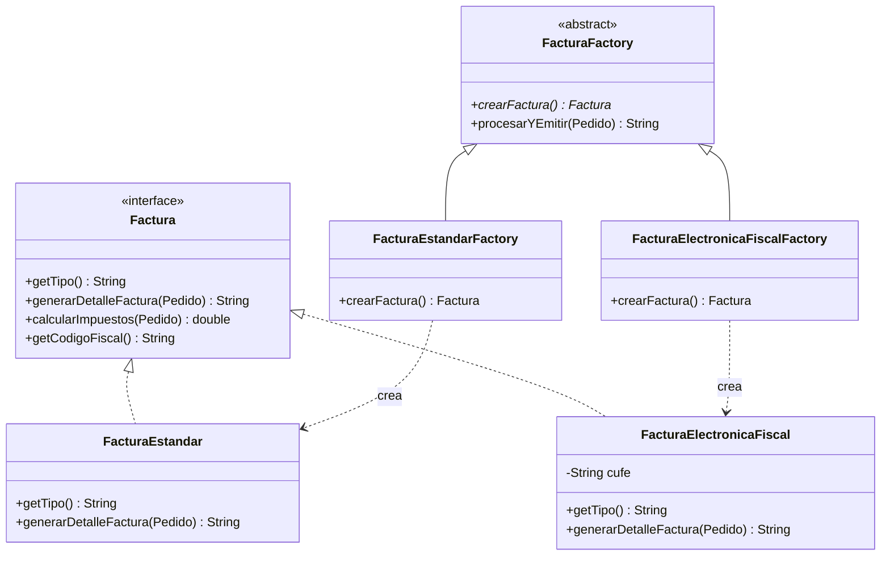

# 📑 INFORME TÉCNICO - SEMANA 4: PATRÓN CREACIONAL FACTORY METHOD
## Proyecto: SmartOrders Enterprise
### Patrón Implementado: Factory Method (GoF) en el Módulo de Facturación

---

### 1. Justificación y Propósito
El sistema requiere emitir distintos tipos de facturación comercial según la naturaleza jurídica del cliente o el canal de venta:
1. **Factura Estándar:** Para personas naturales / consumidor final (POS simplificado).
2. **Factura Electrónica Fiscal:** Con firma digital, código CUFE (Código Único de Factura Electrónica) y discriminación de impuestos para empresas y la DIAN.

Acoplar `FacturacionService` o los controladores a `new FacturaElectronicaFiscal()` violaría el principio de inversión de dependencias (DIP) y dificultaría añadir nuevos formatos en el futuro (ej. Factura de Exportación).

---

### 2. Estructura del Patrón

---

### 3. Código y Conexión REST
El endpoint `POST /api/facturas/generar?pedidoId={id}&tipo={ESTANDAR|ELECTRONICA}` invoca a `FacturacionService`, el cual resuelve la fábrica correspondiente mediante el contenedor de inyección de Spring y ejecuta el Factory Method `crearFactura()`.
