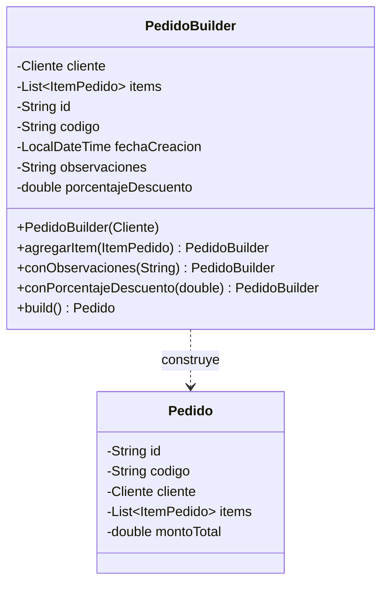

# 📑 INFORME TÉCNICO - SEMANA 5: PATRÓN CREACIONAL BUILDER
## Proyecto: SmartOrders Enterprise
### Patrón Implementado: Builder (GoF) en `PedidoBuilder`

---

### 1. Justificación y Propósito
El objeto `Pedido` representa la entidad central y agregada del dominio. Requiere múltiples datos:
- **Obligatorios:** Cliente titular, al menos un ítem o producto en la canasta.
- **Opcionales:** Código personalizado, fecha de creación, observaciones de entrega, porcentaje y monto de descuento.

Sin el patrón Builder, tendríamos que recurrir al antipatrón de constructores telescópicos (`new Pedido(c, items, null, null, 0.0, null, ...)`), propenso a errores en el orden de argumentos y a la construcción de objetos en estados inconsistentes.

---

### 2. Implementación de Ingeniería
1. **Validación de Invariantes Temprana:** El constructor de `PedidoBuilder(cliente)` rechaza clientes nulos de inmediato.
2. **Método `build()` Determinista:** Comprueba que la lista de items no esté vacía antes de instanciar el pedido final.
3. **Inmutabilidad y Coacción Contable:** Los totales monetarios (`montoBruto`, `montoDescuento`, `montoTotal`) se calculan con redondeo defensivo a 2 decimales (`Math.round(x * 100.0) / 100.0`).

