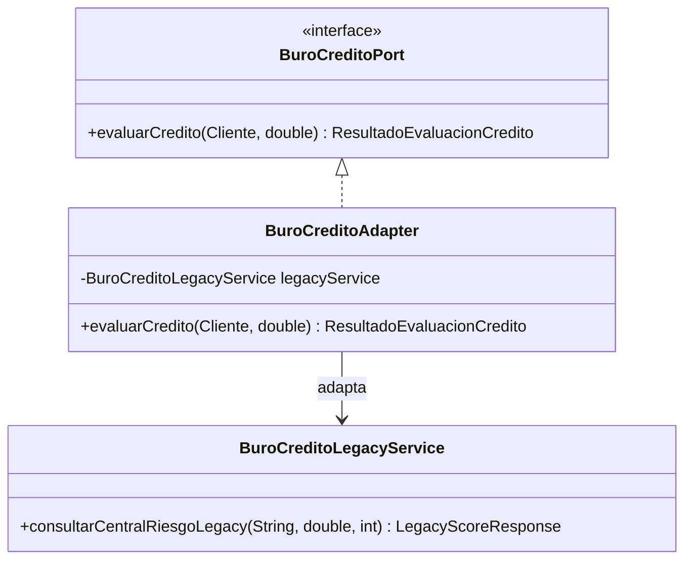
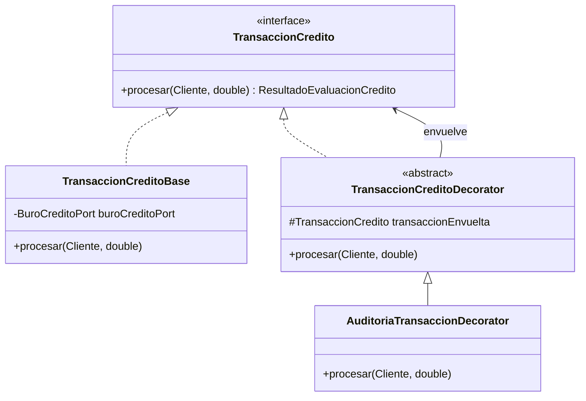

# 📑 INFORME TÉCNICO - SEMANA 6: PATRONES ESTRUCTURALES ADAPTER & DECORATOR
## Proyecto: SmartOrders Enterprise
### Patrones Implementados: Adapter (BuroCreditoAdapter) y Decorator (AuditoriaTransaccionDecorator)

---

### 1. Patrón Adapter: Integración de Centrales de Riesgo Legadas
- **Problema:** El proveedor externo de historial crediticio cuenta con métodos obsoletos (`consultarCentralRiesgoLegacy(documento, saldo, estrato)`) que no encajan con la interfaz `BuroCreditoPort` definida en la arquitectura hexagonal del dominio.
- **Solución:** `BuroCreditoAdapter` implementa `BuroCreditoPort` y traduce los tipos de datos bidireccionalmente, protegiendo al dominio de cualquier alteración en la API del proveedor legado.

---

### 2. Patrón Decorator: Auditoría y Trazabilidad Transaccional
- **Problema:** Toda solicitud de crédito y transacción monetaria debe registrarse en logs forenses estructurados (timestamp, cliente, score, veredicto). Insertar sentencias de logging en la lógica central de negocio ensucia el código y viola el principio SRP.
- **Solución:** Se implementó `AuditoriaTransaccionDecorator`, que envuelve a `TransaccionCreditoBase`. Al invocarse, registra el inicio, ejecuta la evaluación original de forma transparente y emite el dictamen final.

